# Taller Visualización de Datos Espaciales

Como se vio, no existe una única manera de visualizar datos espaciales. Con el proceso de visualización se busca iniciar la exploración de los datos, razón por la cual en esta sesion se abordarán dos de las formas tradicionales de visualización de datos espaciales.

## Patrones Puntuales

Una de las formas de visualización de datos son los patrones puntuales (observación con asignación de longitud y latitud) en los cuales, durante la etapa exploratoria de los datos, se busca identificar agrupamientos y su respectiva densidad. Para este caso se va a trabajar con el ejemplo de la frecuencia de homicidios en Medellín.

Es recomendable, en primer lugar, proceder a cargas las librerías a emplear (si la librería no está instalada, se debe proceder con su instalación):


```R
library(rgdal)    # Importación de Datos (puntos, líneas, polígonos)
library(maptools) # Herramientas de Visualización
library(gstat)    # Geoestadística
library(spatstat) # Geoestadística
library(plotly)   # Proyecciones
```

Para el ejercicio se cuenta con dos archivos: el patrón de datos puntuales debidamente georeferenciados y una capa vectorial con el mapa del municipio de Medellín y su área metropolitana.

Los patrones puntuales se van a denominar puntos y se empleará, en esta oportunidad, la instrucción `readOGR` de la librería `rgdal`. El comando posee dos argumentos básicos que deben emplearse, `dsn` y `layer`; el primero se refiere al directorio dentro del cual se ubican los archivos de trabajo y el segundo al nombre de la capa. Previamente, en la preparación del ambiente de trabajo, se hizo la selección del directorio que contiene la base de la sesión; asi,  la salida de la instrucción señalará la ruta completa:


```R
puntos <- readOGR(dsn = 'Medellin', layer = 'HomicidiosMedellin')
```

    OGR data source with driver: ESRI Shapefile 
    Source: "F:\Dropbox (Personal)\UIS\0000 SEMINARIO ESPACIAL\Talleres\Visualizacion de Datos\Delitos\Medellin", layer: "HomicidiosMedellin"
    with 18265 features
    It has 1 fields
    

Ahora, el mismo procedimiento se emplea para importar el mapa base. Nótese que, a diferencia de la instrucción `readShapePoly` de la librería `maptools` que sólo funciona para importar polígonos, la orden `readOGR` permite importar tanto puntos como polígonos:


```R
mapa <- readOGR(dsn = 'Medellin', layer = 'MapaBase')
```

    OGR data source with driver: ESRI Shapefile 
    Source: "F:\Dropbox (Personal)\UIS\0000 SEMINARIO ESPACIAL\Talleres\Visualizacion de Datos\Delitos\Medellin", layer: "MapaBase"
    with 332 features
    It has 12 fields
    

Ahora, es posible visualizar los patrones puntuales sobre una superficie de referencia que corresponde al mapa base de Medellín y su área metropolitana. Los polígonos de la visualización representan los distintos barrios de la ciudad. Primero, los puntos y luego el mapa para observar la diferencia:


```R
plot(puntos, pch = 20, col = 'red', 
main = 'Mapa de Homicidios en Medellin (2003 - 2016)',
sub = 'Fuente: Policía Nacional')
```


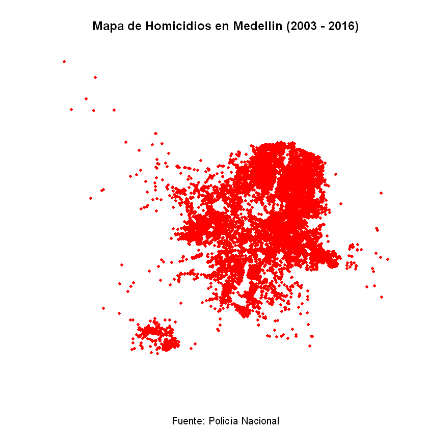


```R
plot(puntos, pch = 20, col = 'red', 
main = 'Mapa de Homicidios en Medellin (2003 - 2016)',
sub = 'Fuente: Policía Nacional')
plot(mapa, add = T, border = 'grey')
```


Para el análisis, es necesario traducir las coordenadas espaciales a coordenadas reales. Con la instrucción `elide` de la librería `maptools` es posible realizar este procedimiento.

En el primer paso, se traduce el objeto tipo `SpatialPointsDataFrame` a un objeto tipo `SpatialPoints` con un sistema de coordenadas estandarizadas


```R
spmed<-as(puntos, "SpatialPoints")
spmed1 <- elide(spmed, scale = TRUE, unitsq = TRUE)
summary(spmed1)
```


    Object of class SpatialPoints
    Coordinates:
         min max
    [1,]   0   1
    [2,]   0   1
    Is projected: NA 
    proj4string : [NA]
    Number of points: 18265


Ahora, se transforma el objeto tipo `SpatialPoints` a un objeto tipo `Planar point pattern`; es decir, se han llevado los puntos espaciales a puntos en un plano cartesiano con coordenadas estandarizadas.


```R
pppmed <- as(spmed1, "ppp")
summary(pppmed)
```


    Planar point pattern:  18265 points
    Average intensity 18265 points per square unit
    
    *Pattern contains duplicated points*
    
    Coordinates are given to 8 decimal places
    
    Window: rectangle = [0, 1] x [0, 1] units
    Window area = 1 square unit


Ahora, se requiere dividir en regiones regulares el área de estudio, reescalar los puntos y contabilizarlos dentro de cada recuadro de la región. En el ejemplo, el plano se va a dividir en un cuadro de $10 \times 10$.

Para reescalar los puntos se emplea la instrucción `rescale` de la librería `spatstat`; para dividir en regiones el plano y contabilizar los puntos espaciales en cada división se emplea el comando `quadratcount` de la misma librería:


```R
swp <- rescale(pppmed)
Q3 <- quadratcount(swp, nx=10, ny=10)
Q3
```


               x
    y           [0,0.1) [0.1,0.2) [0.2,0.3) [0.3,0.4) [0.4,0.5) [0.5,0.6) [0.6,0.7)
      [0.9,1]         0         0         0         0         0         0         0
      [0.8,0.9)       2         0         0         0         0         0         0
      [0.7,0.8)       4         1         0         0         0         0         0
      [0.6,0.7)       0         1         8         3         0        45       449
      [0.5,0.6)       0         2        14        39       141       751      1941
      [0.4,0.5)       1         0         9       187       861       516      1125
      [0.3,0.4)       0         0         0       323       778       540      3342
      [0.2,0.3)       0         2         7        46       297       694       369
      [0.1,0.2)       0         3         4         3       114       371       124
      [0,0.1)         0         0       225       202         5         1        13
               x
    y           [0.7,0.8) [0.8,0.9) [0.9,1]
      [0.9,1]           0         0       0
      [0.8,0.9)         0         0       0
      [0.7,0.8)         0         0       0
      [0.6,0.7)       276         0       0
      [0.5,0.6)      1531        10       0
      [0.4,0.5)      1205        36       1
      [0.3,0.4)       915       116       9
      [0.2,0.3)       292       262      18
      [0.1,0.2)        16         0       1
      [0,0.1)          14         0       0


Ahora, es posible representar todo junto en una misma gráfica:


```R
plot(pppmed, pch = 20)
plot(Q3, add = T, col = 'red')
```


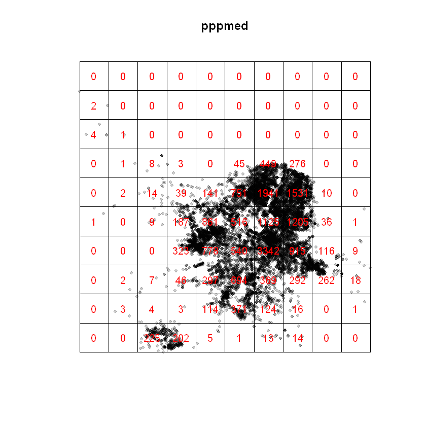


Con lo anterior se tiene la base para calcular la densidad espacial, se emplea una función de intensidad suavizada de núcleo (el término que, por lo general, se emplea es _kernel suavizado_, calculada a partir de los patrones puntuales.

El cálculo de la intensidad se basa en la función `intensity` y la densidad, a partir de puntos planares, se basa en la función `density.ppp`; ambas de la librería `spatstat`:


```R
intensity(Q3)
den <- density.ppp(swp, sigma = 0.05, diggle=TRUE)
```


               x
    y           [0,0.1) [0.1,0.2) [0.2,0.3) [0.3,0.4) [0.4,0.5) [0.5,0.6) [0.6,0.7)
      [0.9,1]         0         0         0         0         0         0         0
      [0.8,0.9)     200         0         0         0         0         0         0
      [0.7,0.8)     400       100         0         0         0         0         0
      [0.6,0.7)       0       100       800       300         0      4500     44900
      [0.5,0.6)       0       200      1400      3900     14100     75100    194100
      [0.4,0.5)     100         0       900     18700     86100     51600    112500
      [0.3,0.4)       0         0         0     32300     77800     54000    334200
      [0.2,0.3)       0       200       700      4600     29700     69400     36900
      [0.1,0.2)       0       300       400       300     11400     37100     12400
      [0,0.1)         0         0     22500     20200       500       100      1300
               x
    y           [0.7,0.8) [0.8,0.9) [0.9,1]
      [0.9,1]           0         0       0
      [0.8,0.9)         0         0       0
      [0.7,0.8)         0         0       0
      [0.6,0.7)     27600         0       0
      [0.5,0.6)    153100      1000       0
      [0.4,0.5)    120500      3600     100
      [0.3,0.4)     91500     11600     900
      [0.2,0.3)     29200     26200    1800
      [0.1,0.2)      1600         0     100
      [0,0.1)        1400         0       0


La intensidad es una función genérica que representa la función de densidad media de un conjunto de datos que representa las unidades por área. Para la densidad se una una función suavizada basada en el ancho de banda relativo al _kernel_ que, por lo general, describe un _Proceso Gaussiano_. La densidad $\lambda$ se calcula mediante la función:

$$
\lambda(u) = e(u) \sum_{i=1}^{n} k \left( x_{i} - u \right) W_{i}
$$

donde $e(u)$ es un factor de corrección; $k$ representa la función de suavizamiento gaussiana o kernel y $w_{i}$ es una matriz de pesos.

Calculada la densidad, es posible representarla gráficamente:


```R
plot(den, axis = T, main = "Density")
#plot(pppmed, pch = 20, add = T, col = 'grey', alpha = 0.1) esta línea es para sobreponer los puntos
contour(den, add = T, col = 'green')
```


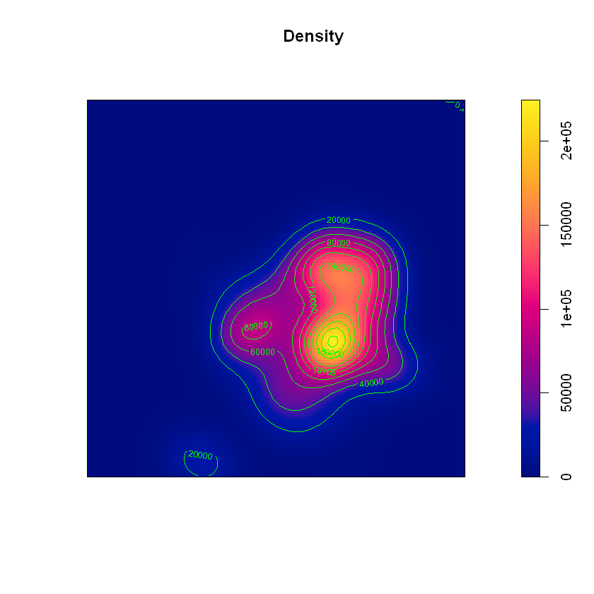


La visualización de la densidad se dificulta en dos dimensiones. Graficar en perspectiva ayuda un poco a interpretar la densidad:


```R
longitud<-den$xcol
latitud<-den$yrow
densidad<-den$v
persp(longitud, latitud, densidad, col = 'gray')
```


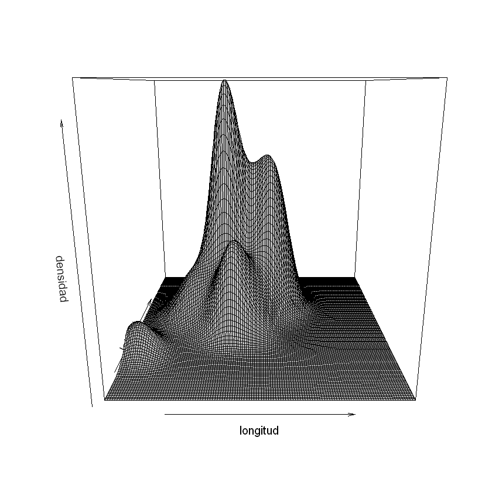


El _kernel_ requiere que se defina un ancho de banda ($\sigma$) que permitirá controlar el suavizamiento de la función. Para esto se emplea la función `bw.ppl` que permite seleccionar el ancho de banda mediante validación cruzada de verosimilitud:


```R
b <- bw.ppl(swp)
```


```R
plot(b, main = 'Validación Cruzada del Ancho de Banda')
```


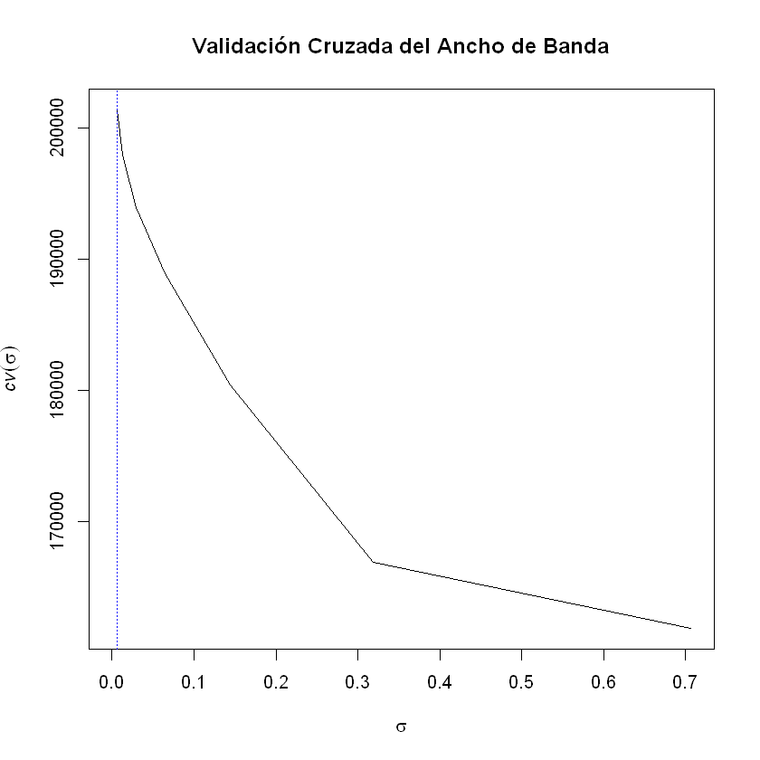


El valor óptimo de $\sigma \approx 0.006$, esto sugiere que la densidad debería ser recalculada; sin embargo, no es necesario hacerlo ya que los cálculos subsiguientes se ajustan de acuerdo al patrón espacial de cada observación.

Antes de continuar, es conveniente observar los puntos sobre un plano con coordenadas. Con ayuda de la función `Sobj_SpatialGrid` de la librería `maptools` es posible configurar los metadatos del patron puntual para asociarlo a una ubicación con Google Earth:


```R
grd <- Sobj_SpatialGrid(puntos,maxDim=50)$SG
plot(grd,axes=T,col="grey")
points(puntos, pch = 20, col = 'green')
plot(mapa, add = T)
```


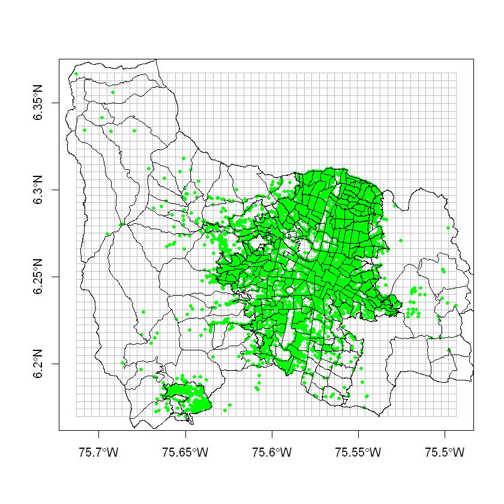


Para poder identificar si se crean o no _clústeres_ en los patrones puntuales se requiere calcular la función de distancia.

El comando `runifpoint` de la librería `spatstat` permite generar un patrón puntual aleatorio a partir del patrón puntual existente mientras que la función `distmap` de la librería `spatstat` permite crear el mapa de distancias:


```R
U <- runifpoint(3, Window(pppmed))
Z <- distmap(pppmed)
Z[U]
```


<ol class=list-inline>
	<li>0.090884375576572</li>
	<li>0.0120697203082672</li>
	<li>0.0470498901384562</li>
</ol>


Ahora, con la función `nncross` es posible identificar al vecino más cercano a cada uno de los puntos y, con la función `distfun` identifica los valores de la función de distancia que define los contornos de las vecindades:


```R
nncross(U, pppmed, what="dist")
f <- distfun(pppmed)
f(U)
```


<ol class=list-inline>
	<li>0.0866870933014291</li>
	<li>0.011976525222136</li>
	<li>0.0410677060724167</li>
</ol>


<ol class=list-inline>
	<li>0.0866870933014291</li>
	<li>0.011976525222136</li>
	<li>0.0410677060724167</li>
</ol>


Con lo anterior, el mapa de contornos es el siguiente:


```R
plot(Z)
contour(Z, add = T, col = 'White')
```


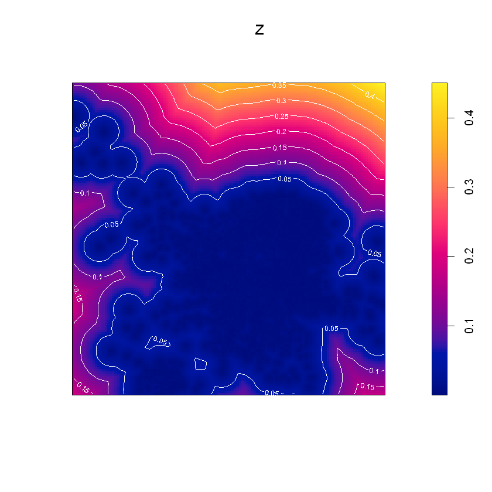


Con el patrón aleatorio creado a partir de los datos observados se observa evidencia de posibles agrupamientos; es necesario comprobar la existencia de _clúesteres_. Con ayuda del comando `clarkevans` es posible calcular el índice de Clark & Evans. El índice de Clark & Evans (1954) es una medida cruda de agrupamiento u ordenamiento de patrones de puntos. Relaciona la distancia promedio más cercana observada en el patrón y la esperada para un proceso de Poisson de la misma intensidad. Si $R>1$ sugiere ordenamiento; si $R<1$ sugiere agrupamientos:


```R
clarkevans(pppmed)
```


<dl class=dl-horizontal>
	<dt>naive</dt>
		<dd>0.244966762557341</dd>
	<dt>Donnelly</dt>
		<dd>0.244219296606242</dd>
	<dt>cdf</dt>
		<dd>0.216569169192983</dd>
</dl>


El índice de Clark & Evans encontrado sugiere (en cada caso) la presencia de _clústeres_. El test correspondiente permite contrastar esta hipótesis. Con el comando `clarkevans.test` de la librería `spatstat` es posible realizar la comprobación de la hipótesis. En este caso se emplea el argumento `alternative="clustered"`:


```R
clarkevans.test(pppmed, correction="donnelly", alternative="clustered")
```


    
    	Clark-Evans test
    	Donnelly correction
    	Monte Carlo test based on 999 simulations of CSR with fixed n
    
    data:  pppmed
    R = 0.24422, p-value = 0.001
    alternative hypothesis: clustered (R < 1)
    


Como se había observado al momento de calcular el índice existen varias correcciones. Se ha empleado una de ellas para realizar la prueba y, con esta evidencia, es posible concluir que existen agrupamientos en los patrones puntuales asociados a la ocurrencia de homicidios en Medellín.

Otra forma de abordar el problema es la explorción gráfica. Uno de los gráficos empleados para tal fin es el diagrama de _Stienen_. Consiste en dibujar un círculo sobre cada punto cuyo diámetro corresponde a la distancia con el vecino más cercano. Ningún círculo se sobrepone a otro, es decir, el límite de los diámetros es el diámetro del círculo asociado al vecino más cercano. Otra opción de visualización es el mosaico de _Dirichlet_; consiste en un conjunto de polígonos que se construyen de manera similar al diagrama de Stienen.

Para esta visualización se emplean las funciones `stienen` y `dirichlet` respectivamente:


```R
stienen(pppmed, main = 'Stienen')
plot(dirichlet(pppmed), main = 'Dirichlet')
```

    Warning message:
    "5411 duplicated points were removed"
         PLEASE NOTE:  The components "delsgs" and "summary" of the
     object returned by deldir() are now DATA FRAMES rather than
     matrices (as they were prior to release 0.0-18).
     See help("deldir").
     
         PLEASE NOTE: The process that deldir() uses for determining
     duplicated points has changed from that used in version
     0.0-9 of this package (and previously). See help("deldir").
    
    
    


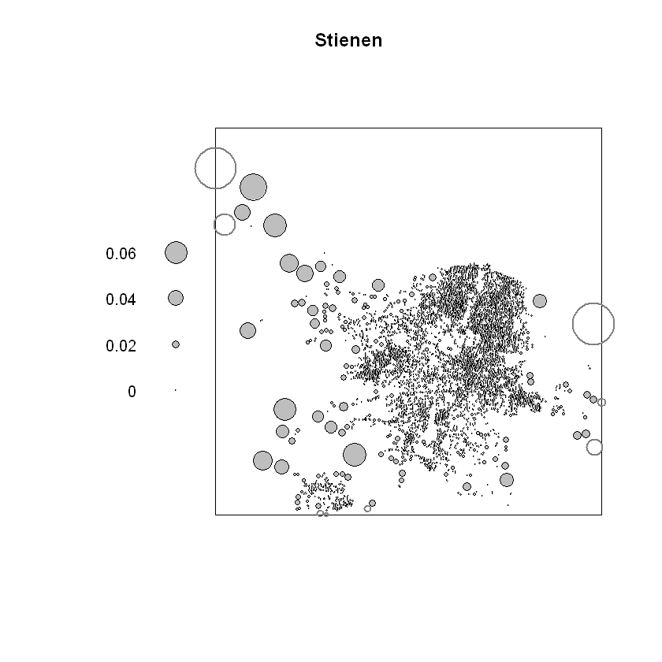


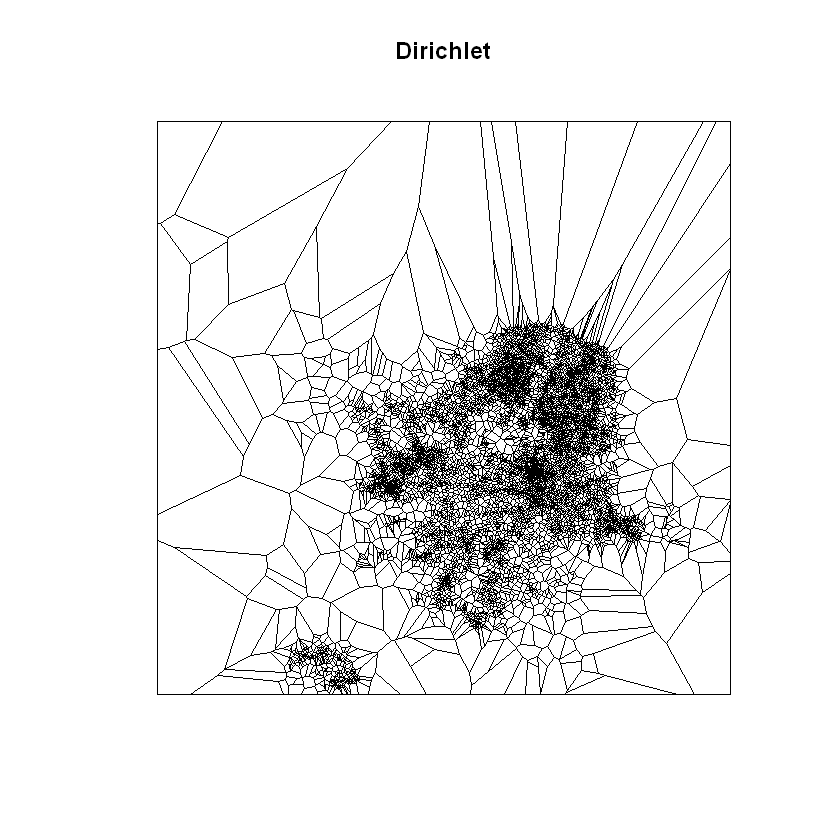


Existen dos funciones que permiten determinar si los procesos espaciales son aleatorios o no. Una es la _Función de Espacio Vacío_ y la otra es la _Función de Vecino más Cercano_. Aunque ambas son equivalentes, son funciones completamente distintas.

Para su estimación se emplean los comandos `Fest` y `Gest` respectivamente


```R
Fs <- Fest(pppmed)
Gs <- Gest(pppmed)
plot(Fest(swp), main = 'Función de Espacio Vacío')
plot(Gest(swp), main = 'Función de Vecino más Cercano')
```


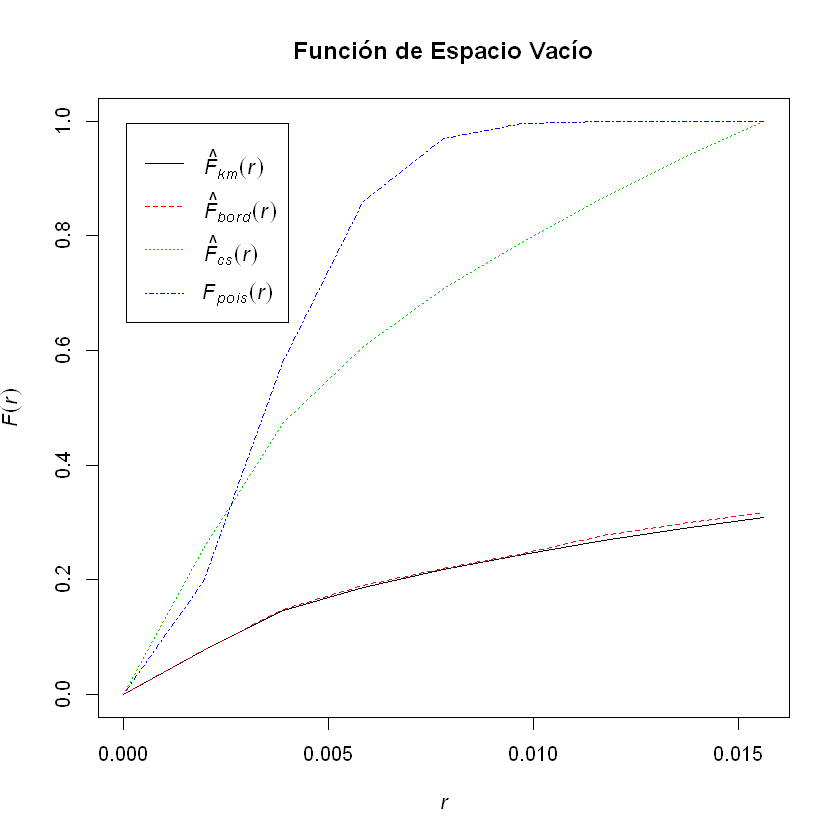


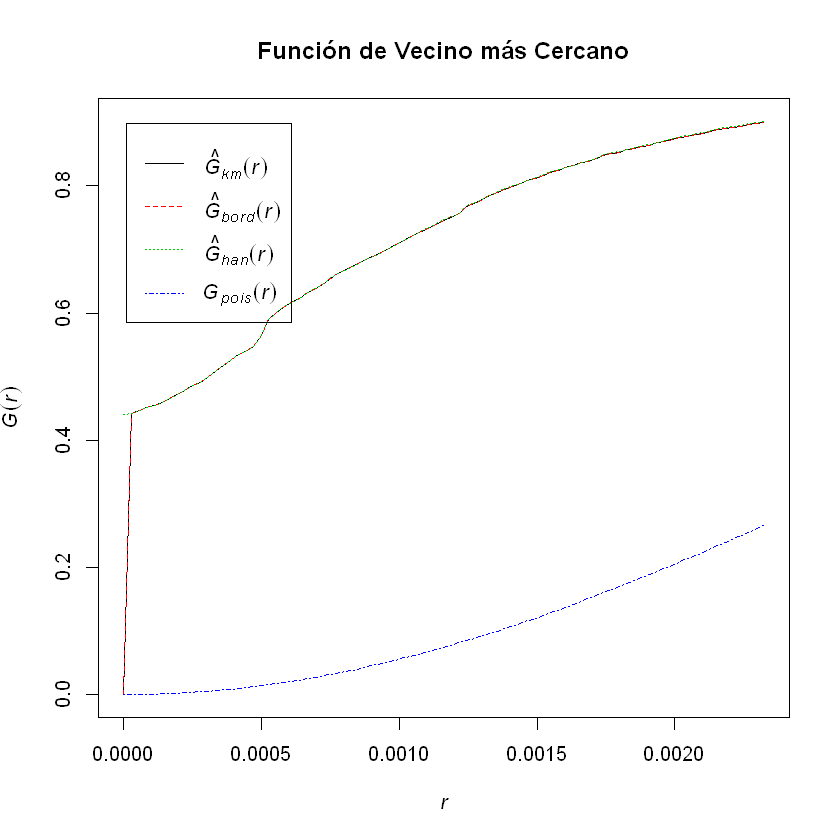

